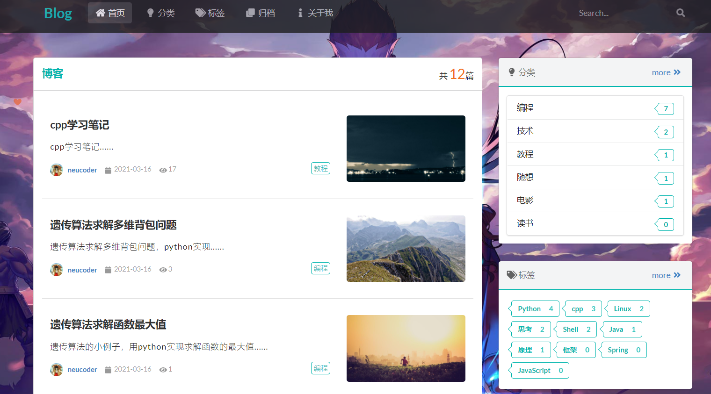

# 个人博客项目
* 后端: *spring boot, JPA, thymeleaf*
* 数据库: *MySQL*
* 前端: *semantic ui*

## 遇到困难

1. spring datasource mysql 在application.yml的密码设置为0000时不好使
   通过调试之后发现读取配置后的密码变为0，暂时没搞清楚原因。

2. postmaping  getmaping 注解处理不同的请求分别对应post和get出现请求错误时可以作相应的修改

3. 标签管理页面 前端校验功能不成功 校验的时候需要前端代码进行相应的修改

4. 后端的代码报错的时候，有可能是前端渲染出现了错误

5. 查表的时候查不到，需要@Entity注解